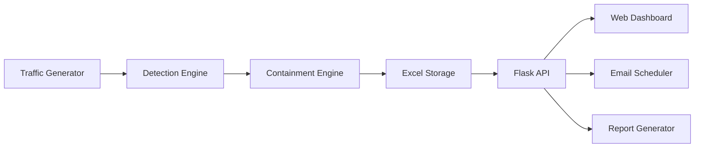
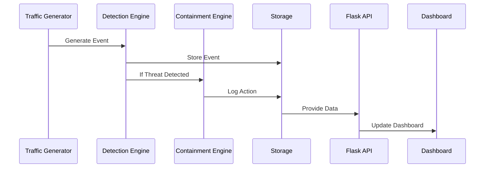

# 🚀 FAST RAT
## Fast Automated Security Threat Response & Analysis Tool


> A modular, rule-based SOAR-inspired Incident Response Automation Platform built with Python, Flask, and Docker.

---

# 📌 Overview

FAST RAT (Fast Automated Security Threat Response & Analysis Tool) is a lightweight incident response automation system designed to detect, analyze, and respond to cybersecurity threats in real time.

It simulates a modern SOC workflow by integrating:

- Threat detection  
- Incident classification  
- Automated containment  
- Dashboard monitoring  
- Email reporting  
- Structured incident tracking  

The system demonstrates core SIEM + SOAR concepts in a containerized, modular architecture.

---

# 📑 Table of Contents

1. Introduction & Objectives  
2. Theoretical Background  
3. System Architecture  
4. Data Flow  
5. Technology Stack  
6. Database Schema  
7. Implementation Details  
8. API Endpoints  
9. Deployment  
10. Features  
11. Testing & Validation  
12. Limitations  
13. Future Improvements  
14. Conclusion  
15. Authors  

---

# 1️⃣ Introduction & Objectives

## 🎯 Problem Statement

Modern Security Operations Centers (SOCs) face:

- High alert volumes  
- Alert fatigue  
- Delayed incident response  
- Manual containment inefficiencies  

FAST RAT reduces response time from hours to seconds by automating detection and containment for critical threats.

---

## 🎯 Objectives

- Automated rule-based threat detection  
- Severity-based incident classification  
- Automatic containment for CRITICAL threats  
- Real-time monitoring dashboard  
- Incident lifecycle tracking  
- Email reporting  
- Containerized deployment  

---

# 2️⃣ Theoretical Background

## 🛡️ Incident Response Lifecycle (NIST-Aligned)

FAST RAT aligns with the NIST IR lifecycle:

1. Preparation  
2. Detection & Analysis  
3. Containment  
4. Post-Incident Activity  

Primary automation focus: Detection & Containment.

---

## 📊 SIEM Concepts Implemented

- Event collection  
- Log aggregation  
- Rule-based correlation  
- Alert generation  

---

## 🤖 SOAR Concepts Implemented

- Automated response execution  
- Case management  
- Action logging  
- Orchestration logic  

---

## ⚠️ Threat Categories

- Ransomware Activity (CRITICAL)  
- Data Exfiltration (CRITICAL)  
- Malware Detection (CRITICAL)  
- Brute Force Attacks (HIGH)  
- Port Scanning (HIGH)  
- SQL Injection (HIGH)  
- Suspicious Logins (MEDIUM)  
- Policy Violations (MEDIUM)  

---

# 3️⃣ System Architecture



---

# 4️⃣ Data Flow



---

# 5️⃣ Technology Stack

- Python 3.x  
- Flask  
- HTML / CSS / JavaScript  
- Chart.js  
- Pandas + OpenPyXL  
- SMTP  
- Docker & Docker Compose  

---

# 6️⃣ Database Schema

## incidents.xlsx
- incident_id  
- title  
- severity  
- status  
- source_ip  
- created_at  
- actions_taken  

## events.xlsx
- event_id  
- event_type  
- source_ip  
- severity  
- payload  
- timestamp  

## actions.xlsx
- action_id  
- action_type  
- target  
- status  
- performed_by  
- timestamp  

---

# 7️⃣ Implementation Structure

```text
FAST-RAT/
├── api_server.py
├── ir_core.py
├── log_generator.py
├── Dockerfile
├── docker-compose.yml
├── templates/
│   └── dashboard.html
└── data/
```

---

# 8️⃣ API Endpoints

- GET `/api/dashboard`  
- GET `/api/incidents`  
- GET `/api/events/recent`  
- GET `/api/actions`  
- GET `/api/reports/download`  
- POST `/api/actions/block-ip`  

---

# 9️⃣ Deployment

## Docker (Recommended)

```bash
docker-compose up --build
```

Access: http://localhost:5000

## Manual Setup

```bash
pip install -r requirements.txt
python api_server.py
```

---

# 🔟 Features

- Real-time dashboard  
- Automated containment  
- Manual containment options  
- Email reports  
- Excel export  
- Incident analytics  
- Action history logging  
- Containerized deployment  

---

# 1️⃣1️⃣ Testing & Validation

- Dashboard Load: < 1 second  
- API Response: < 100ms  
- Event Processing: ~100 events/min  
- Memory Usage: ~150MB  

Security validation includes input sanitization, SMTP protection, and controlled API responses.

---

# 1️⃣2️⃣ Limitations

- Simulated containment  
- Excel-based storage (non-scalable)  
- No authentication  
- Rule-based detection only  
- Single-container architecture  

---

# 1️⃣3️⃣ Future Improvements

- JWT authentication  
- Database migration (PostgreSQL)  
- WebSocket real-time updates  
- SIEM integration  
- ML-based anomaly detection  
- Threat intelligence feeds  
- Playbook automation  

---

# 1️⃣4️⃣ Conclusion

FAST RAT demonstrates how incident response automation can reduce response time, improve consistency, and provide centralized SOC visibility through a modular and extensible architecture.

---

# 👨‍💻 Authors

- Marwan Hamdy  
- Abdelrahman Mohamed  
- Abdelrahman Wael  
